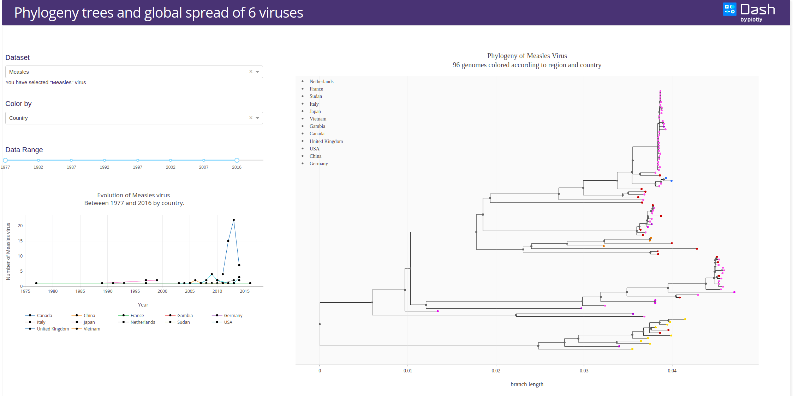
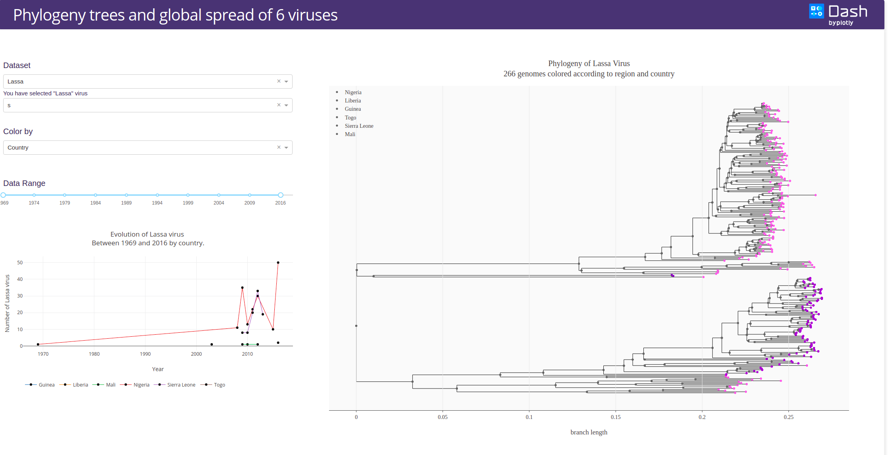
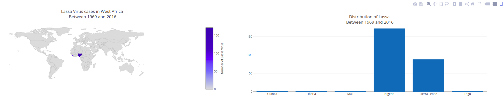

# Dash virus phylogenetic tree Application

This is a demo of the Dash interactive Python framework developed by [Plotly](https://plot.ly/).

Dash abstracts away all of the technologies and protocols required to build an interactive web-based application and is a simple and effective way to bind a user interface around your Python code.

To learn more check out our [documentation](https://plot.ly/dash).

## Introduction
In this area, include a brief description of what the application does, and include a link to the [Heroku application](https://dash-phylogeny.herokuapp.com/).

### [Technique/field associated with the instrument]
Give a brief description of the scientific background related to the application that you're interfacing with.

## Requirements
- The Python version required is >= 3 to control this app;
- The list of all packages is listed in requirements file (see requirements.txt);
- The commands to run that will set up this app and get it ready to run : >python3.6 app.py

## How to use the app
The command needed to run the app:
python3.6 app.py

In the web page, you can select the bacteria, and the genes in depends on the bacteria.

## Resources

External packages used in the project:
- biopython (https://biopython.org/wiki/Documentation)
- nominatim (https://geopy.readthedocs.io/en/stable/)

## Screenshots
The following are screenshots for the app in this repo:

